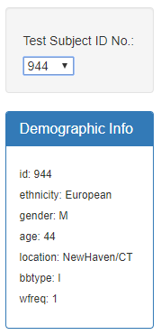
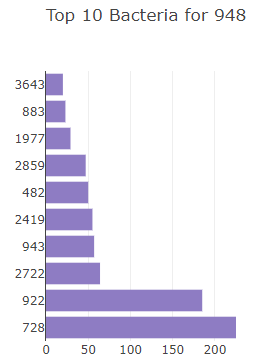
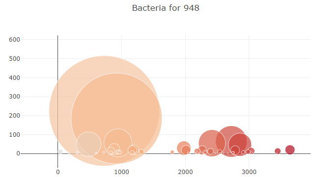

# bacteria_analysis
Module 12

## Project Summary
Use D3.json() to read information from a JSON file and create an interactive dashboard.
The dashboard contains the following 3 interactive featers:

# 1 - Demographics panel with drop down list
A volunteer ID is chose from the drop down list.  That demographics for that volunteer ID is shown and the two charts explained below dynamically update to display the information specific for the ID chosen.

# 2 Bar Chart
Dynamically display the top 10 bactria for the volunteer ID picked from the drop down menu.

#3 Bubble Chart
Dynamically display the relative frequency of all bacteria found on volunteer ID picked from the drop down menu.

